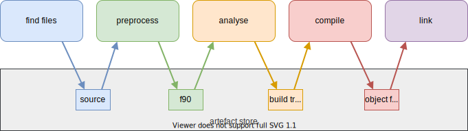

.. _Config Intro:

Introduction to Config
**********************

Use Fab to build your Fortran and C project using a series of *build steps*.

Here is an example of a build config. They are written in Python.
It provides some ready made, configurable steps for you to use, and it's easy to create your own.

.. code-block::

    config = Config(
        project_label='my project',
        steps=[
            GrabFolder(src='~/my_repo'),
            FindSourceFiles(),
            fortran_preprocessor(),
            Analyse(root_symbol='my_program'),
            CompileFortran(),
            LinkExe(),
        ])

Fab is designed to minimise user input by by providing sensible defaults.
For example, in the snippet above we don't tell the compiler which files to compile.
By default it knows to use the build tree created by the preceding ``Analyse`` step.

More details about steps can be found in the :ref:`guide to writing config<Writing Config>`.

.. _artefacts_overview:

Artefacts
=========

Steps can read and create named collections of :term:`Artefact`
in the :term:`Artefact Store`.

Fab runs each step in order, passing in the :term:`Artefact Store` which contains all previous steps' output.

Multiprocessing
===============

Steps have access to multiprocessing methods.
The Step class includes a multiprocessing helper method called :meth:`~fab.steps.Step.run_mp` which steps can call
from their :meth:`~fab.steps.Step.run` method to process a collection of artefacts in parallel.

