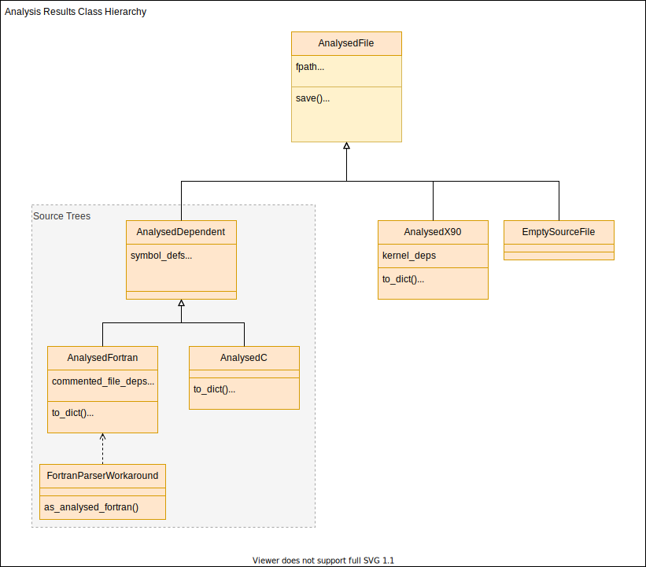

.. _Development:

Developer's guide
*****************
Information for developers of Fab.

.. _Install from source:

Install from source
===================
The following commands will checkout the latest version of the code and create an
`editable install <https://pip.pypa.io/en/stable/cli/pip_install/#editable-installs>`_.
This lets you edit the code without needing to reinstall fab after every change.

.. code-block:: console

    $ git clone https://github.com/metomi/fab.git <fab-folder>
    $ pip install -e <fab-folder>

You can install extra features by using [test], [docs], [features] or [dev], as defined in setup.py.

.. code-block:: console

    $ pip install -e <fab-folder>[dev]

Source code Analysis
====================
See :mod:`~fab.steps.analyse` for a description of the analysis process.

The class hierarchy for analysis results can be seen below.
Classes which are involved in source tree analysis contain symbol definitions and dependencies,
and the file dependencies into which they are converted.

Incremental & Prebuilds
=======================
See :term:`Incremental Build` and :term:`Prebuild` for definitions.

Prebuilt artefacts are stored in a flat *_prebuild* folder underneath the *build_output* folder.
They include a checksum in their filename to distinguish between different builds of the same artefact.
All prebuild files are named: `<stem>.<hash>.<suffix>`, e.g: *my_mod.123.o*.

Checksums
---------
Fab inserts a checksum in the names of prebuild files. This checksum is derived from
everything which should trigger a rebuild if changed. Before an artefact is created, Fab will
calculate the checksum and search for an existing artefact so it can avoid reprocessing the inputs.

Analysis results
----------------
Analysis results are stored in files with a *.an* suffix.
The checksum in the filename is solely the hash of the analysed source file.
Note: this can change with different preprocessor flags.

Fortran module files
--------------------
When creating a module file from a Fortran source file, the prebuild checksum is created from hashes of:

 - source file
 - compiler
 - compiler version

Fortran object files
--------------------
When creating an object file from a Fortran source file, the prebuild checksum is created from hashes of:

 - source file
 - compiler
 - compiler version
 - compiler flags
 - modules on which the source depends

Running the tests
=================
You'll need to install from source, and a full :ref:`[dev] install<Install from source>` to get the testing dependencies.

Unit and system tests
---------------------
From the fab folder, type:

.. code-block:: console

    $ pytest tests/unit_tests
    $ pytest tests/system_tests

Flake8 and mypy
---------------
When making a PR, you might want to run all the checks which give us green ticks.
You can see the commands we run in ``.github/workflows/build.yml``.
To run flake8 and mypy, type:

.. code-block:: console

    $ flake8 .
    $ mypy setup.py source tests

Acceptance tests
----------------
**(For Met Office users)**

For extra confidence, we have acceptance tests in the ``run_configs`` folder which are not run as part of our
automated github testing. You can run them on the VDI using ``build_all.py``. However, this will choke your machine
for some time. There's a (misnamed) cron you can run nightly, ``run_configs/_cron/cron_system_tests.sh``.
There's also a rose suite which runs them on spice in ``run_configs/_rose_all``.

Github Actions
==============

Testing a PR
------------
The github action defined in ``.github/workflows/build.yml`` automatically runs the unit and system tests,
plus flake8 and mypy, and adds green ticks to pull requests.

Build these docs
----------------
The github action to build the docs is defined in ``.github/workflows/build_docs.yml``.
It is manually triggered and can be run from any branch in the metomi repo.
You can also run it on your fork to produce a separate build, for viewing work in progress.

.. _Build Singularity:

Build singularity image
-----------------------
**(For Met Office users)**

The config file in envs/picasso defines the contents of a Singularity image which is built by the
experimental Picasso app. We can build this image using a GitHub action,
defined in ``.github/workflows/picasso_build.yml``.
This action is manually triggered. You have to push a branch to the metomi repo, not a fork,
then you can trigger the action from your branch. Please remember to clean up the branch when you're finished.

You can see the image in artefactory
`here <https://metoffice.jfrog.io/ui/repos/tree/General/docker-local/picasso/metomi/fab/MyImage>`_.

See also
* :ref:`Run Singularity<Run Singularity>`
* `Picasso <https://metoffice.sharepoint.com/sites/scienceitteam/SitePages/Picasso.aspx>`_

Version numbering
=================
We use a `PEP 440 compliant <https://peps.python.org/pep-0440/#examples-of-compliant-version-schemes>`_
semantic versioning, of the form ``{major}.{minor}.{patch}[{a|b|rc}N]``

* 0.9.5
* 1.0.0a1
* 1.0.0a2
* 1.0.0b1
* 1.0.0rc1
* 1.0.0
* 1.0.1
* 1.1.0a1

Dev versions are not for release and cover multiple commits.
* 1.0.dev0
* ...
* 1.0.0
* 1.0.dev1
* ...
* 1.0.1

The version number is defined in ``source/fab/__init_.py``.
