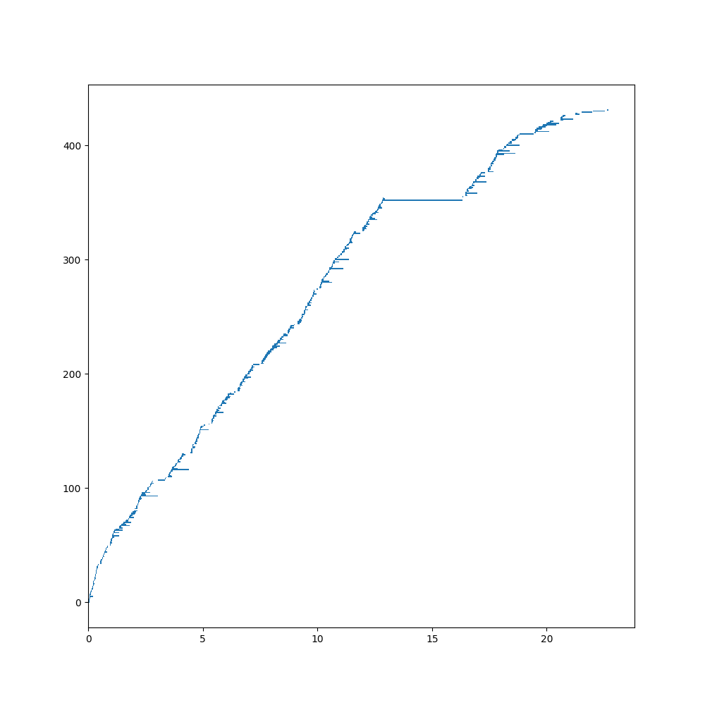

.. _Features:

Features
********
Fab is an open source Python project. Feel free to get involved.

Dependency Analysis
===================
Fab automatically discovers your C and Fortran source files.
You don't need to manually specify and maintain an ordered list of files,
which can become problematic in a large project.

Fab determines the dependency hierarchy, including through C-Fortran interfacing,
and thus determines the Fortran compile order. C is compiled in a single pass.

Incremental Build
=================
Fab "watermarks" each artefact with a checksum of its inputs.
Subsequent builds avoid reprocessing by searching for watermarks in the prebuild folder.

Sharing Prebuilds
=================
Artefacts from previous builds can be shared between users,
either by copying the prebuild folder or using the :func:`~fab.steps.grab.grab_pre_build` step.

Extensible
==========
It's easy to add custom steps to your build script, e.g manipulating code, calling new tools, etc.

.. _Zero Config:

Zero Config
===========
It's possible to run ``fab`` from the command line, in your source folder, for a default build operation.
For more complicated builds you may write a build script.

Git, SVN and FCM
================
Fab can fetch and merge source from remote repositories.

.. _Metrics:

Metrics
=======
Fab will record the time taken by each step and plot them on a pie chart.

.. image:: img/pie.png
    :width: 66%
    :alt: pie chart

Some steps also record metrics about their individual artefacts.
For example below, the Fortran preprocessor created this histogram from the processing time of individual files,

.. image:: img/hist.png
    :width: 66%
    :alt: pie chart

and the Fortran compiler created this `busby-style graph <https://www.osti.gov/biblio/1393322>`_
showing a compilation bottleneck.

Limitations
===========

Fortran single-line IF calls
----------------------------
Whilst fab can automatically determine Fortran dependencies from module use statements,
and from standalone call statements, it doesn't currently detect a dependency from a call statement on a
single-line if statement: `IF (x .GT. 0) CALL foo()`. Please see here for
:ref:`the workaround<Unrecognised Deps Workaround>`.

Name Clash
----------
Fab currently assumes there are no name clashes in your project by the time we reach certain build steps:

 - C and Fortran symbols go into one symbol table so there can be no duplicate symbol names
   by the time we reach the analysis stage.
 - Fortran mod files are created in a flat folder, so Fortran module names must be unique
   by the time we reach the compile stage.
 - C and Fortran object files are both compiled into `.o` files so there can be no duplicates,
   such as `util.c` and `util.f90`
   by the time we reach the compile stage.

There may be duplicates earlier in the build process. For example, there may two versions of a module,
each wrapped in a `#ifdef` so that one of them is empty after preprocessing (empty files are ignored during analysis).
Another approach is to use file filtering in the :class:`~fab.steps.find_source_files.find_source_files` step.

Fortran Include Folders and Incremental Build
---------------------------------------------
Fab generates a hash of Fortran `*.mod` file dependencies, and notices if a dependency changes, triggering a recompile.
However, it can only currently do this for Fortran `*.mod` files inside the project workspace (or source_root override).
It will *not* notice if a Fortran `*.mod` changes in an include folder elsewhere.

An example is the UM build which uses GCom's mpl.mod.
This issue is raised in `#192 <https://github.com/metomi/fab/issues/192>`_.
