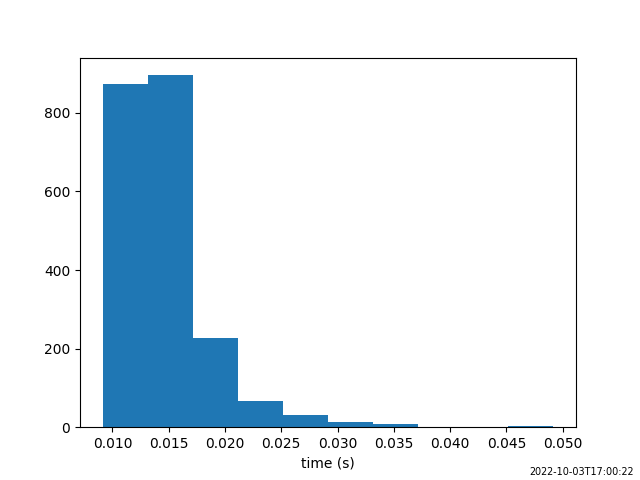

Features
********

Dynamic Source Tree Detection
=============================
Fab identifies the dependencies in your C and Fortran source code.
It will determine the Fortran compile order, which means you don't have to manually specify and maintain
the compile order, which can become problematic in a large project.

Incremental Build
=================
Fab "watermarks" each artefact with a checksum of its inputs.
Subsequent builds avoid reprocessing by searching for watermarks in the prebuild folder.

Sharing Prebuilds
=================
Artefacts from previous builds can be shared between users,
either by copying the prebuild folder or using the :class:`~fab.steps.grab.GrabPreBuild` step.

Metrics
=======
Fab will record the time taken by each step and plot them on a pie chart.

.. image:: img/pie.png
    :width: 66%
    :alt: pie chart

Some steps also record metrics about their individual artefacts.
For example below, the Fortran preprocessor created this histogram from the processing time of individual files,

and the Fortran compiler created this `busby-style graph <https://www.osti.gov/biblio/1393322>`_
showing a compilation bottleneck.

.. image:: img/busby.png
    :width: 66%
    :alt: pie chart

Limitations
===========

Dependency detection
--------------------
Whilst fab can automatically determine dependencies from module use statements,
and from standalone call statements, it doesn't currently detect a dependency from a call statement on a
single-line if statement: `IF (x .GT. 0) CALL foo()`.

We can pass the analyser any symbol dependencies which Fab can't detect.
The files which contain them, *and their dependencies*, will make their way through to the compile and link stages.
This is done using the `unreferenced_deps` argument to the :class:`~fab.steps.analyse.Analyse` step.
Here's how we do this for JULES.

.. code-block::

    steps = [
        ...
        Analyse(root_symbol='jules', unreferenced_deps=['imogen_update_carb']),
        ...
    ]

Name Clash
----------
Fab currently assumes there are no name clashes in your project by the time we reach certain build steps:

 - C and Fortran symbols go into one symbol table so there can be no duplicate symbol names
   by the time we reach the analysis stage.
 - Fortran mod files are created in a flat folder, so Fortran module names must be unique
   by the time we reach the compile stage.
 - C and Fortran object files are both compiled into `.o` files so there can be no duplicates,
   such as `util.c` and `util.f90`
   by the time we reach the compile stage.

There may be duplicates earlier in the build process. For example, there may two versions of a module,
each wrapped in a `#ifdef` so that one of them is empty after preprocessing (empty files are ignored during analysis).
Another approach is to use file filtering in the :class:`~fab.steps.find_source_files.FindSourceFiles` step.

Fortran Include Folders and Incremental Build
--------------------------------------------
Fab generates a hash of mod file dependencies, and notices if a dependency changes, triggering a recompile.
However, it can only currently do this for mods in the project workspace (or source_root override).
It will *not* notice if a mod changes in an include folder.

An example is the UM build which uses GCom's mpl.mod.
This is recorded in `#192 <https://github.com/metomi/fab/issues/192>`_.
