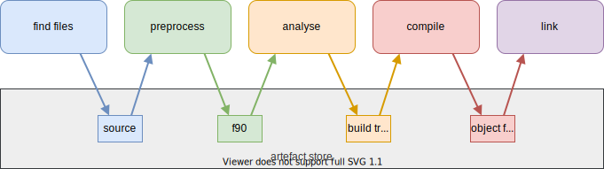

Fab Overview
============

Use Fab to build your Fortran and C project using a series of *build steps*.

Fab can analyse your code to determine dependencies, including those between C and Fortran.
It can work out which files need to be compiled, in which order, to create an executable,
and it can build all your source into a static or shared library.

Steps
-----

You provide fab with list of build steps.

Fab provides some ready made, configurable steps for you to use, and it's easy to create your own.
All build steps are derived from the :class:`~fab.steps.Step` class.

.. _artefacts_overview:

Artefacts
---------

Steps can read and create :term:`Named Collections <Named Collection>` of :term:`Artefact`
in the :term:`Artefact Store`.

Fab runs each step in order, passing in the :term:`Artefact Store` which contains all previous steps' output.
As an example, a Fortran preprocessing step might create a list of output paths
as ``artefact_store['preprocessed fortran'] = my_results``, which a subsequent analysis step would read.

Example Config
--------------

Fab uses *config as code*. We aim to minimise the amount of config required by the user
so most of Fab's steps have sensible defaults. In the snippet below, we don't need to tell
the steps which :term:`Named Collections <Named Collection>` to read or create.
The compiler steps, for example, know they should look for file paths in an artefact collection called ``"build tree"``,
unless we tell them otherwise.

Example::

    config = Config(
        label='my fab build',
        steps=[
            FindSourceFiles(),
            CPreProcessor(),
            FortranPreProcessor(common_flags=['-P', '-I$source/include']),
            Analyse(root_symbol='my_program'),
            CompileC(common_flags=['-std=c99']),
            CompileFortran(common_flags=['-J', '$output']),
            LinkExe(
                flags=['-lc', '-lgfortran', '-L', 'lib', '-l', 'mylib'],
                output_fpath='my_program.exe')
        ])

Under consideration: Fab might get a config file format in the future.

Multiprocessing
---------------

Steps have access to multiprocessing methods.
The Step class includes a multiprocessing helper method called :meth:`~fab.steps.Step.run_mp` which steps can call
from their :meth:`~fab.steps.Step.run` method to process a collection of artefacts in parallel.

Limitations
-----------
**Dependency detection:** Whilst fab can automatically determine dependencies from module use statements,
and from standalone call statements, it doesn't currently detect a dependency from a call statement
on a single-line if statement.
