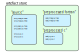

Fab Overview
============

Use Fab to build your Fortran and C project using a series of build steps.

Fab analyses your code to determine dependencies, including those between C and Fortran.
It can work out which files need to be compiled, in which order, to create an executable
or build all your source into a static or shared library.

Steps
-----

You can configure the list of build steps, configure the steps themselves
and create your own custom build steps. All build steps are derived from the :class:`~fab.steps.Step` class.

Example::

    workspace = Path('my_workspace')

    config = Config(label='my fab build', workspace=workspace)

    config.steps = [
        GetSourceFiles(workspace / 'source'),
        CPreProcessor(),
        FortranPreProcessor(
            common_flags=['-traditional-cpp', '-P',
                '-I', '$source/gcom/include',
                '-DGC_VERSION="7.6"'],
        ),
        Analyse(root_symbol='my_program'),
        CompileC(common_flags=['-c', '-std=c99']),
        CompileFortran(compiler='gfortran', common_flags=['-c', '-J', '$output']),
        LinkExe(
            linker='gcc',
            flags=['-lc', '-lgfortran', '-L', 'lib', '-l', 'libmylib'],
            output_fpath='my_program.exe')
    ]

.. _artefacts_overview:

Artefacts
---------

Steps usually read and create a :term:`Named Collection` in the :term:`Artefact Store`.
Fab runs each step in order, passing in the :term:`Artefact Store` which contains all previous steps' output.

As an example, a Fortran preprocessing step might create a list of output paths
as ``artefact_store['preprocessed fortran'] = my_results``.
A subsequent step could read this list.

Multiprocessing
---------------

Steps have access to multiprocessing methods. The :class:`~fab.steps.mp_exe.MpExeStep` class captures common aspects
of any step which passes a list of artefacts through a command-line tool.
(The existence of this class is currently under debate.)
The Step class includes a multiprocessing utility method called :meth:`~fab.steps.Step.run_mp` which steps can call
from their :meth:`~fab.steps.Step.run` method to pass a collection of artefacts through a processor function
in parallel.
